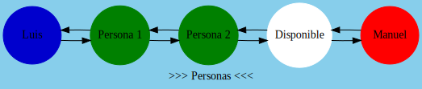
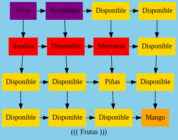
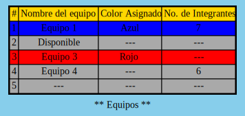

# SimpleGraph

Universidad de San Carlos de Guatemala  
Facultad de Ingeniería  
Escuela de Ciencias y Sistemas  
Lenguajes Formales y de Programación  
Primer Semestre 2021

## Archivos de prueba - Proyecto #2  

### [Lista.lfp](Lista.lfp)
```js
lista ('>>> Personas <<<',circulo,verdadero){
    nodo ('Luis') azul2 ;
    nodos (2, 'Persona') verde2;
    nodo (#) #; // Nodo con valores por defecto
    nodo ('Manuel') rojo2;
} defecto ('Disponible') blanco;
```


### [Matriz.lfp](Matriz.lfp)
```js
matriz (4,4,'((( Frutas )))',rectangulo,falso){
    fila ('Uvas', 'Arandanos') morado2;
    fila ('Sandias',#,'Manzanas')rojo2;
    nodo (3,3,'Piñas')#;
    nodo (4,4,'Mango') anaranjado2;
} defecto ('Disponible') amarillo2;
```


### [Tabla.lfp](Tabla.lfp)
```js
tabla (3,'** Equipos **'){
    fila ('Equipo 1', 'Azul', '7') Azul2;
    fila ('Disponible') #;
    fila ('Equipo 3', 'Rojo') Rojo2;
    fila ('Equipo 4',#,'6')#;
    encabezados ('Equipo','Color Asignado','No. Integrantes') amarillo2;
    fila (#)#; //Tendrá los valores por defecto

} defecto ('---') gris2; 
```


